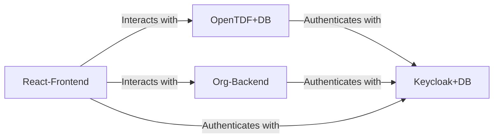

<p align="center">
  
</p>

<p align="center">
  <a href="https://chat.whatsapp.com/JFlI9aRvNaGCTU2lOFXpOt">
    
  </a>
</p>

# 🛡️ Arkavo Platform

## The Official GitHub Repository for Arkavo's Web Backend and React App

<div style="background-color: #fff3cd; border-left: 6px solid #ffecb5; padding: 1em; font-size: 1.2em; font-weight: bold;">
📢 <strong>Note:</strong>  
The official secure <strong>Arkavo</strong> hosted backend is <strong>free to use!</strong><br><br>
Most users wanting to host their own platform should refer to the <a href="webapp/README.md">WebApp Readme</a>.<br>
If you insist on running your own backend, read on.
</div>

---

## 🧰 Installation

1. 🖥️ Obtain a public, internet-facing host such as an AWS EC2 instance.  
2. 📦 Clone this repository:
   ```bash
   git clone https://github.com/arkavo-org/arkavo-platform/
    ```
3) Run the backend
   ```bash
   python run.py
    ```
   This will generate all your template files
5) Edit "editme.py" to represent your brand name and colors
6) Obtain the necessary certifications. Copy them as fullchain.pem and privkey.pem in /certs. There are scripts for this if you look hare enough
7) Run the backend again, with the templates
   ```bash
   python run.py
    ```
8) That's it! Navigate to https://yourhost/ to make sure the included frontend is running

## Expanation
This repository is an amalgamation of best-in-class tools in Security and AI, arranged to work together with minimum configuration. Practically it serves as the entire backend for the Arkavo forum. 

Components of this repo include  
- **Ollama** - The best-in-class open-source LLM management solution
- **Keycloak** - The best-in-class open-source identity and auth solution
- **OpenTDF** - The best-in-class Attribute-Based Access Control (ABAC) addendum to Keycloak
- **Org** - Handles needs of organizations using Arkavo forum - Events, Communications, Permissions
- **Nginx-Proxy** - Serves the other services as HTTPS  
- **Synapse** - The best-in-class open-source Instant Messenger solution
- **AICouncil** - Recommends improvements to this repo in real time

## System Diagram - Mermaid

