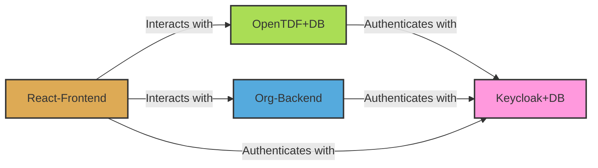

<p align="center">
  
</p>

# Arkavo Platform

<p align="center">
  <a href="https://chat.whatsapp.com/JFlI9aRvNaGCTU2lOFXpOt">
    
  </a>
  
  
</p>

## 📑 Overview

The official GitHub repository for Arkavo's Web Backend and React App - an integrated security and AI platform.

> [!NOTE]
> **The official secure Arkavo hosted backend is FREE to use!**  
> Most users wanting to host their own platform should refer to the [WebApp Readme](webapp/README.md).  
> If you insist on running your own backend, read on.

## 🧰 Installation

### Prerequisites
- A public, internet-facing host (e.g., AWS EC2 instance)
- Git
The Setup script can install
- Docker
- Python

### Setup Steps

1. **Clone the repository**
   ```bash
   git clone https://github.com/arkavo-org/arkavo-platform/
   cd arkavo-platform
   ```

2. **Run the backend initially**
   ```bash
   python run.py
   ```
   This will generate all your template files.

3. **Configure your instance**
   - Edit `editme.py` to customize your brand name and colors
   - Obtain necessary SSL certificates and copy them as `fullchain.pem` and `privkey.pem` in `/certs` directory

4. **Launch with templates**
   ```bash
   python run.py
   ```

5. **Verify installation**
   - Navigate to `https://yourhost/` to ensure the included frontend is running

## 🏗️ Architecture

Arkavo Platform integrates best-in-class tools for Security and AI, arranged to work together with minimal configuration.

### Core Components

| Component | Description |
|-----------|-------------|
| **Ollama** | Best-in-class open-source LLM management solution |
| **Keycloak** | Best-in-class open-source identity and authentication solution |
| **OpenTDF** | Best-in-class Attribute-Based Access Control (ABAC) addendum to Keycloak |
| **Org** | Handles organizational needs - Events, Communications, Permissions |
| **Nginx-Proxy** | Serves other services via HTTPS |
| **Synapse** | Best-in-class open-source Instant Messenger solution |

## 🔄 System Diagram



## 📚 Documentation

For more detailed information about each component:

- [WebApp Documentation](webapp/README.md)
- [Keycloak Configuration](docs/keycloak.md)
- [OpenTDF Integration](docs/opentdf.md)

## 🤝 Contributing

Contributions are welcome! Please feel free to submit a Pull Request.

## 📄 License

This project is licensed under the MIT License - see the LICENSE file for details.

## 📞 Contact

Join our [WhatsApp Group](https://chat.whatsapp.com/JFlI9aRvNaGCTU2lOFXpOt) for community support.
